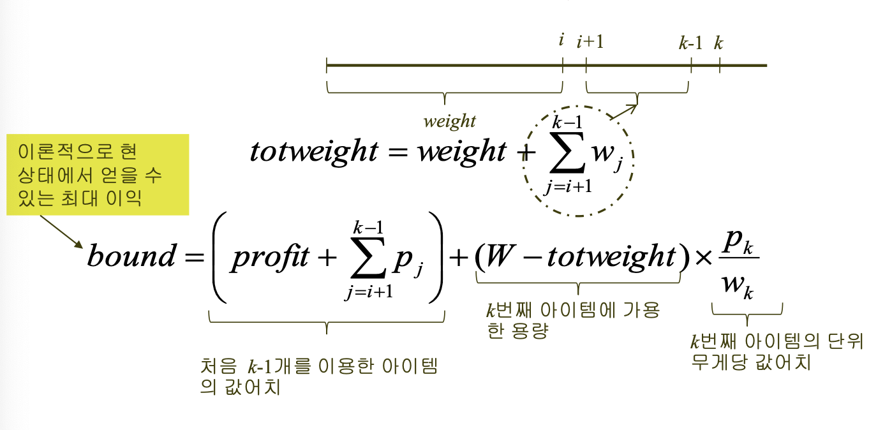

<h1>2024-05-21</h1>
<strong>Theme 💭 </strong>
<small>알고리즘 실습 12</small>

 

## 목차

1. [분기한정법](#분기한정법)
2. [0-1 배낭 문제 해결하기](#0-1-배낭-문제-해결하기)
 - [분기한정 가지치기 너비우선검색](#분기한정-가지치기-너비우선검색)
 - [분기한정 가지치기 최고우선검색](#분기한정-가지치기-최고우선검색)

 

## 정리

## 분기한정법

- 특징
    - 되추적 기법과 같이 상태공간트리를 구축하여 문제를 해결
    - 최적의 해를 구하는 문제에 적용할 수 있음
    - 최적의 해를 구하기 위해서는 **모든 해를 고려**해 보아야 하기 때문에,
    마디를 순회하는 방법에 구애받지 않는다.

- 원리
    - 각 마디를 검색할 때마다, 그 마디가 유망한지 여부를 결정하기 위해 한계값(bound)를 계산한다.
    - 그 한계치는 그 마디로부터 가지를 뻗어나가서(branch) 얻을 수 있는 해답값의 한계를 나타낸다.
    - 따라서 만약 그 한계값이 지금까지 찾은 최적의 해답값보다 좋지 않은 경우는 더 이상 가지를 뻗어 검색할 필요가 없다. -> 유망하지 않다(nonpromising)

## 0-1 배낭 문제 해결하기

- 0-1 Knapsack Problem
    - profit: 그 마디에 오기까지 넣었던 아이템 가치의 함
    - weight: 그 마디에 오기까지 넣었던 아이템 무게의 합

- 우선, 상태공간트리를 구축하여 **되추적** 기법으로 문제를 푼다고 하자.
- n level 마디에서 왼쪽으로 가면 n+1 번째 아이템을 배낭에 넣는 경우이고,
오른쪽으로 가면 n+1 번째 아이템을 배낭에 넣지 않는 경우
- 이런 식으로 상태공간트리를 구축하면, 루트노드부터 리프노드까지 모든 경로가 해답 후보
- **최적의 해**를 구해야 하므로 검색이 완전히 끝날 때까지 해답을 알 수 없다.
따라서 검색 과정 동안 항상 그때까지 찾은 최적의 해를 기억해 두어야 한다.

- 분기한정법을 사용한다면, bound의 개념을 사용하자.
    - bound: 마디가 수준 i에 있다고 하고, 수준 k에 있는 마디에서 총 무게가 W를 넘는다고 하자. 그러면

- maxprofit: 지금까지 찾은 최선의 해답이 주는 가치
- bound <= maxprofit이면 수준 i에 있는 마디는 유망하지 않음

- wi와 pi를 각각 i번째 아이템의 무게와 값어치라고 하면, pi /wi 의 값이 큰 것부터 내림차순으로 아이템을 정렬한다. (일종의 탐욕적인 방법이 되 는 셈이지만, 알고리즘 자체는 탐욕적인 알고리즘은 아니다.)

### 분기한정 가지치기 깊이우선검색

- 깊이우선검색 - 배열 + 재귀로 구현

### 분기한정 가지치기 너비우선검색

- 너비우선검색 - queue로 구현 (방문할 점들을 순서대로 저장했다가 FIFO)

### 분기한정 가지치기 최고우선검색

1. 주어진 마디의 모든 자식마디를 검색 후
2. 유망하면서 확장되지 않은(unexpanded) 마디를 살펴보고
3. 그 중에서 가장 좋은 한계치(bound)를 가진 마디를 확장한다.