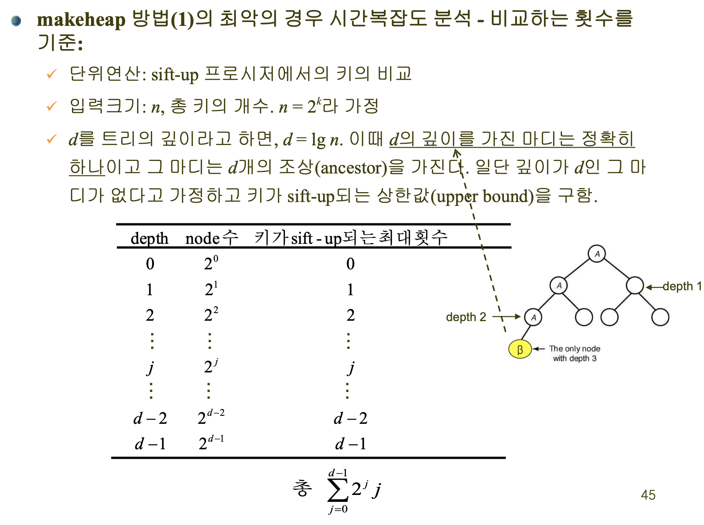
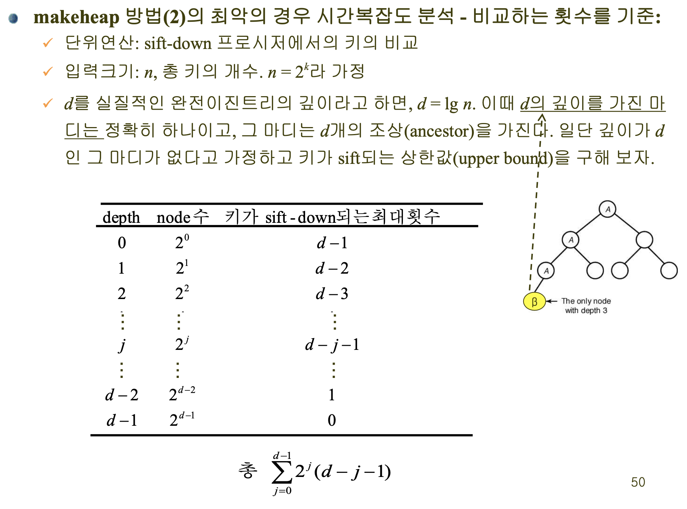

<h1>2024-06-03</h1>
<strong>Theme 💭 </strong>
<small>알고리즘 실습 13</small>

 

## 목차

1. [힙정렬](#힙정렬)
2. [힙을 생성할 때의 두 가지 방법](#힙을-생성할-때의-두-가지-방법)

 

## 정리

### 힙정렬

- Heap
    - 어떤 마디에 저장된 값은 그 마디의 자식마디에 저장된 값보다 크거나 같다 (max heap)
    - 힙의 성질을 만족하는 실질적인 완전이진트리

- 힙 정렬
    - n개의 키를 이용하여 힙을 구성한다.
    - 루트에 있는 제일 큰 값을 제거한다. → 힙 재구성
    - 위 과정을 n-1번 반복

- Sift
    - 채로 치다
    - 힙 성질을 만족하도록 트리를 재구성하는 방법

    - SiftDown
        - 루트에 있는 키가 힙 성질을 만족하지 않음
        → 루트에서 키를 추출하고 힙 성질을 회복

    - Siftup
        - 자식노드가 부모노드보다 크다면 swap을 루트노드까지 진행

- RemoveKeys
    - 힙 정렬을 위해 키를 초기화

### 힙을 생성할 때의 두 가지 방법

1. 데이터가 입력되는 순서대로 heap을 매번 구성

    

2. 모든 데이터를 트리에 넣은 상태에서 heap 구성

    