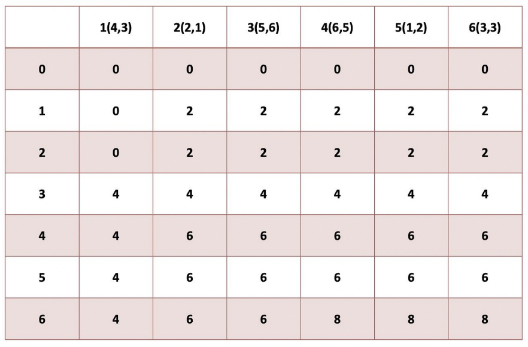

<h1>2024-11-18</h1>
<strong>Theme 💭 </strong>
<small> 배낭 문제와 Union Find </small>

<br/>

## 목차

1. [배낭 문제](#)
2. [Union Find](#)

<br/>

# 배낭 문제 (KnapSack Problem)

- N개의 물건이 있음
    
    - 각 물건은 1개씩만 담을 수 있음
    - 각 물건별로 '가치'와 '무게'가 있음

- 배낭이 있음

    - 최대로 담을 수 있는 무게의 제한이 있음

- 배낭에 담을 수 있는 최대 가치는 얼마인가?

## 부분 배낭 문제 (Fraction KnapSack Problem)

- 물건을 쪼갤 수 있는 상황 (쌀, 보리 등)

- 무게에 대한 가성비를 따진 뒤, 순서대로 정렬하고, 앞에서부터 채워넣기

## 0-1 배낭 문제 (0-1 KnapSack Problem)

- 물건을 쪼갤 수 없어서 넣거나 넣지 않거나 **둘 중 하나만 가능**한 상황

    - 0: 안 넣는다 / 1: 넣는다

    -> DP를 통해 해결할 수 있음

- 최대 M까지 담을 수 있고, 각각의 무게를 w라 하자.

    - 가방의 공간은 (M-w) or M

    - 단순히 위 과정을 가방에 공간이 없을 때까지 반복하기!

    - 행위가 두 가지로 제한, 표현할 수 있게 됨

- 동일한 부분 문제로 분할 가능. 최적 분할 구조가 만들어짐!

- 그러면 각 경우에서 담거나, 안 담거나.

### DP 테이블

- dp[i][j] = 최대 무게가 j인 가방에서 i번째 물건까지 판단했을 때의 최대 가치

- 아무것도 넣지 않았을 때

    - dp[i][j] = dp[i-1][j]

- 물건을 넣을 때

    - dp[i][j] = dp[i-1][j-w] + v[i]

    - 주의사항: (j-w)는 음수가 될 수 없다 (최대 무게를 넘을 수 없다!!)


- 물건 i의 무게 > 배낭 j의 크기 (못 넣음)

    - dp[i][j] = dp[i-1][j]

- 물건 i의 무게 <=> 배낭 j의 크기

    - dp[i][j] = max(dp[i-1][j], i가치 + dp[i-1][j-w])

- 주의사항: 초깃값 잘 정해두기

    - 무게가 0: 모두 0 (아무것도 넣을 수 없음)

    - 0번째 물건에 대해: 모두 0 (넣을 물건이 없음)

- 정답은 dp[n][m]이 됨

    - 만약 전체 무게가 m보다 작더라도, 어차피 dp[0][x]에서 시작했다고 가정해도 됨. (가치가 0인 물건 더 넣었다고 쳐)



### 최적화

- 인덱스 i는 어차피 i-1만 보며, 각 항목에 대해서는 인덱스가 같거나 (j) 더 작은 경우 (j-w)만 본다.

- 따라서 일차원 배열로 줄일 수 있음

- 단, 반드시 높은 무게부터 내려가는 방식을 써야 함. 낮은 익덱스를 덮어쓰면 안 됨.

```C++

    ...
    int main(){
        int n, k, w[101], v[101];
        int dp[100001]={};
        scanf("%d %d", &n, &k);
        for(int i=1;i<=n;i++){
            scanf("%d %d", &w[i], &v[i]);
        }
        for(int i=1;i<=n;i++){
            for(int j=k;j>=1;j--){
                if(j>=w[i]) dp[j]=max(dp[j], dp[j-w[i]]+v[i]);
            }
        }
    }
    ... 

```

- COINS

    - 해당 숫자를 만드는 방법의 경우의 수 + 해당 숫자를 만들 수 있는 경우의 수 (?)

    - 합의 경우의 수

        - 특정 숫자를 만드는 경우의 수

        - 각 숫자를 만들 수 있는 경우의 수

        - Map으로 하면 메모리 양이 줄어듦

<br>

---

# Union Find

## Disjoint 집합

- 서로 중복되지 않는 부분집합들로 나누어진 원소들에 대한 정보를 저장하고 조작

- 서로소 집합

- 상호 배타적인 부분집합들로 나누어진 원소들에 대한 자료구조

## Union-Find

- 같은 집합에 있는지 확인을 해야 한다. 집합 별로 번호(=부모)를 붙여 판단하자!

- Union 연산 + Find 연산

    - 서로 같은 그래프 = 같은 집합이다

- 해당 집합의 루트 노드 이름을 기반으로 같은 집합인지 판단

    - Find: 해당 집합의 루트 찾기

- 두 집합을 합치는 것은, 한 집합의 루트의 부모를 다른 집합으로 한다.

    - 부모 자식 관계가 중요한 것이 아님.

    - Union: 합치기

### 시간 초과

- 이 방식은 find 연산에서 완전탐색과 똑같은 시간복잡도가 발생하게 된다.

- 따라서 최적화 필요!

## Find 최적화: 경로 압출 기법 사용

- 부모 노드를 찾아서 저장 -> 다음에 빨리 찾아볼 수 있다.

    - 이 방식도 첫 탐색 때는 완전탐색

## Union 최적화

- 현재 길이를 저장해두자!

    - 더 큰 트리에 더 작은 트리를 붙이면 최대 높이가 변하지 않는다.

    - Find 시간복잡도 대폭 감소

    - 두 트리의 길이가 같다면, 길이가 1 증가하게 된다. (아무데나 붙여)

- rank 배열에 길이를 저장하는 방법

- 근데 굳이 메모리 낭비를 해야 할 이유가 있을까?

    - 어차피 루트는 나 자신만 반환한다.

    - 어차피 rank도 루트만 사용한다.

- 그렇다면, 루트 노드의 값은 음수로 사용하자.

    - 초기에 -1로 초기화.

    - 아 어차피 다른 노드들도 부모 노드의 값을 저장해야 하구나.

- 여기서는 음수의 절대값이 커야 깊이가 깊은 거니까 => 더 작은 쪽에다 붙인다